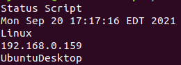

 **Fisher Price's my first bash scripts and what they do:**
                  
**days.sh**: Script loops through days of the week, reminding you that each day is not Sunday, until Sunday comes around, reminding you to relax.

**delsys.sh**: Script checks if user is root, if user is root, prompts with message not to run as root. If user is not root, deletes sys_info.txt file inside /research/ folder.

**research.sh**: Script checks if a folder named research1 exists, if not, it creates it. 

**state.sh**: Script checks a few different state names including one user supplied variable and reminds you that Hawaii is a better state. This was broken during testing of the IFS tag. It probably won't be fixed. It still works, but it's not /overly/ verbose. Consider it built-in debugging mode.

**sys_info.sh**: Script prints Date, Time, Timezone, Year, Operating System, IP Address, Host machine name

**test.sh**: Script takes user input after script name as variable and is able to tell if it is less than 10 or not. Absolutely cutting edge.