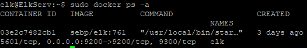

## Automated ELK Stack Deployment

The files in this repository were used to configure the network depicted below.


These files have been tested and used to generate a live ELK deployment on Azure. They can be used to either recreate the entire deployment pictured above. Alternatively, select portions of the playbook file may be used to install only certain pieces of it, such as Filebeat.

  ```console
   GNU nano 4.8                                      filebeat-playbook.yml
---
- name: installing and launching filebeat
  hosts: webservers
  become: yes
  tasks:

  - name: download filebeat deb
    command: curl -L -O https://artifacts.elastic.co/downloads/beats/filebeat/filebeat-7.6.1-amd64.deb

  - name: install filebeat deb
    command: sudo dpkg -i filebeat-7.6.1-amd64.deb

  - name: drop in filebeat-config.yml
    copy:
      src: /etc/ansible/files/filebeat-config.yml
      dest: /etc/filebeat/filebeat.yml

  - name: enable and configure system module
    command: sudo filebeat modules enable system

  - name: setup filebeat
    command: sudo filebeat setup

  - name: start filebeat service
    command: service filebeat start

  - name: enable service filebeat on boot
    systemd:
      name: filebeat
      enabled: yes
 ```

This document contains the following details:
- Description of the Topology
- Access Policies
- ELK Configuration
  - Beats in Use
  - Machines Being Monitored
- How to Use the Ansible Build


### Description of the Topology

The main purpose of this network is to expose a load-balanced and monitored instance of DVWA, the D*mn Vulnerable Web Application.

Load balancing ensures that the application will be highly available, in addition to restricting accessibility to the network.

Integrating an ELK server allows users to easily monitor the vulnerable VMs for changes to the system logs and system performance metrics.

The configuration details of each machine may be found below.
| Name            | Function      | IP Address     | Operating System     |
|-------------    |-----------    |------------    |------------------    |
| RedTeamJump     | Gateway       | 10.0.0.4 / 40.71.225.155       | Ubuntu 20.04         |
| Web1            | DVWA1         | 10.0.1.6       | Ubuntu 20.04         |
| Web2            | DVWA2         | 10.0.1.7       | Ubuntu 20.04         |
| ElkServ         | ELK Stack     | 10.1.0.4       | Ubuntu 20.04         |
| LoadBalancer    | Load Balancer | 40.188.149.161 | Azure Loadbalancer |
### Access Policies

The machines on the internal network are not exposed to the public Internet, with exception of routing through the LoadBalancer IP Address to expose DVWA login access. 

Only the Gateway machine can accept connections from the Internet. Access to this machine is only allowed from the following IP addresses:
- 99.239.131.129/32

Machines within the network can only be accessed by RedTeamJump via internal IP of 10.0.0.4, RedTeamJump can only be accessed via SSH via Public internet via my personal IP address.


A summary of the access policies in place can be found in the table below.

| Name             | Publically Accessible     | Allowed IP Addresses                     |
|--------------    |-----------------------    |--------------------------------------    |
| RedTeamJump      | Yes                       | 99.239.131.129/32                        |
| Web1             | Through Load Balancer     | 10.0.0.4 40.88.149.161                   |
| Web2             | Through Load Balancer     | 10.0.0.4 40.88.149.161                   |
| ElkServ          | Yes                       | 99.239.131.129/32 10.0.1.6  10.0.1.7     |
| LoadBalancer     | Yes                       | Any                                      |

### ELK Configuration

Ansible was used to automate configuration of the ELK machine. No configuration was performed manually, which is advantageous because it allows for consistent, reproducible deployment across unlimited scale with a write-once execute many architecture.

The playbook implements the following tasks:
- Install docker using apt_get
- Install python3-pip using apt
- Install docker using pip
- Configure sysctl to use more memory
- Download and launch an ELK container from sebp/elk using docker_container

The following screenshot displays the result of running `docker ps` after successfully configuring the ELK instance.



### Target Machines & Beats
This ELK server is configured to monitor the following machines:
- 10.0.1.6 (DVWA)
- 10.0.1.7 (DVWA)

We have installed the following Beats on these machines:
- Filebeat
- Metricbeat

These Beats allow us to collect the following information from each machine:
- Filebeat is collecting system log files in addition to application log files generated from DVWA LAMP container
- Metricbeat is collection system performance metric information, including cpu usage, memory usage, disk usage

### Using the Playbook
In order to use the playbook, you will need to have an Ansible control node already configured. Assuming you have such a control node provisioned: 

SSH into the control node and follow the steps below:
- Copy/create the playbook file in YAML to from /etc/ansible/files to /etc/ansible/
- Update the /etc/ansible/hosts file to include target ip addresses under their respective [groupname] heading
- Run ansible-playbook target-playbook.yml --limit [groupname], and navigate to target servers to check that the installation worked as expected.
