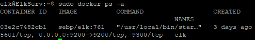

## Automated ELK Stack Deployment

The files in this repository were used to configure the network depicted below.


These files have been tested and used to generate a live ELK deployment on Azure. They can be used to either recreate the entire deployment pictured above. Alternatively, select portions of the playbook file may be used to install only certain pieces of it, such as Filebeat.

  ```yaml
   GNU nano 4.8                                      filebeat-playbook.yml
---
- name: installing and launching filebeat
  hosts: webservers
  become: yes
  tasks:

  - name: download filebeat deb
    command: curl -L -O https://artifacts.elastic.co/downloads/beats/filebeat/filebeat-7.6.1-amd64.deb

  - name: install filebeat deb
    command: sudo dpkg -i filebeat-7.6.1-amd64.deb

  - name: drop in filebeat-config.yml
    copy:
      src: /etc/ansible/files/filebeat-config.yml
      dest: /etc/filebeat/filebeat.yml

  - name: enable and configure system module
    command: sudo filebeat modules enable system

  - name: setup filebeat
    command: sudo filebeat setup

  - name: start filebeat service
    command: service filebeat start

  - name: enable service filebeat on boot
    systemd:
      name: filebeat
      enabled: yes
 ```

This document contains the following details:
- Description of the Topology
- Access Policies
- ELK Configuration
  - Beats in Use
  - Machines Being Monitored
- How to Use the Ansible Build


### Description of the Topology

The main purpose of this network is to expose a load-balanced and monitored instance of DVWA, the D*mn Vulnerable Web Application.

Load balancing ensures that the application will be highly available, in addition to restricting accessibility to the network.

Integrating an ELK server allows users to easily monitor the vulnerable VMs for changes to the system logs and system performance metrics.

The configuration details of each machine may be found below.
| Name            | Function      | IP Address     | Operating System     |
|-------------    |-----------    |------------    |------------------    |
| RedTeamJump     | Gateway       | 10.0.0.4 / 40.71.225.155       | Ubuntu 20.04         |
| Web1            | DVWA1         | 10.0.1.6       | Ubuntu 20.04         |
| Web2            | DVWA2         | 10.0.1.7       | Ubuntu 20.04         |
| ElkServ         | ELK Stack     | 10.1.0.4       | Ubuntu 20.04         |
| LoadBalancer    | Load Balancer | 40.188.149.161 | Azure Loadbalancer |
### Access Policies

The machines on the internal network are not exposed to the public Internet, with exception of routing through the LoadBalancer IP Address to expose DVWA login access. 

Only the Gateway machine can accept connections from the Internet. Access to this machine is only allowed from the following IP addresses:
- 99.239.131.129/32

Machines within the network can only be accessed by RedTeamJump via internal IP of 10.0.0.4, RedTeamJump can only be accessed via SSH via Public internet via my personal IP address.


A summary of the access policies in place can be found in the table below.

| Name             | Publically Accessible     | Allowed IP Addresses                     |
|--------------    |-----------------------    |--------------------------------------    |
| RedTeamJump      | Yes                       | 99.239.131.129/32                        |
| Web1             | Through Load Balancer     | 10.0.0.4 40.88.149.161                   |
| Web2             | Through Load Balancer     | 10.0.0.4 40.88.149.161                   |
| ElkServ          | Yes                       | 99.239.131.129/32 10.0.1.6  10.0.1.7     |
| LoadBalancer     | Yes                       | Any                                      |

### ELK Configuration

Ansible was used to automate configuration of the ELK machine. No configuration was performed manually, which is advantageous because it allows for consistent, reproducible deployment across unlimited scale with a write-once execute many architecture.

```yaml
install-elk.yml
---
- name: Configure Elk VM with Docker
  hosts: elk
  remote_user: elk
  become: true
  tasks:
    # Use apt module
    - name: Install docker.io
      apt:
        update_cache: yes
        force_apt_get: yes
        name: docker.io
        state: present

      # Use apt module
    - name: Install python3-pip
      apt:
        force_apt_get: yes
        name: python3-pip
        state: present

      # Use pip module (It will default to pip3)
    - name: Install Docker module
      pip:
        name: docker
        state: present


      # Use sysctl module
    - name: Use more memory
      sysctl:
        name: vm.max_map_count
        value: "262144"
        state: present
        reload: yes

      # Use docker_container module
    - name: download and launch a docker elk container
      docker_container:
        name: elk
        image: sebp/elk:761
        state: started
        restart_policy: always
        # Please list the ports that ELK runs on
        published_ports:
          -  5601:5601
          -  9200:9200
          -  5044:5044

      # Use systemd module
    - name: Enable service docker on boot
      systemd:
        name: docker
        enabled: yes
```

The playbook implements the following tasks:
- Targets elk group in ansible hosts file as elk user
- Install docker using apt_get
- Install python3-pip using apt
- Install docker using pip
- Configure sysctl to use more memory
- Download and launch an ELK container from sebp/elk using docker_container
- Publishes ELK to run on ports internally/externally: 5601, 9200, 5044 for Kibana, Elasticsearch, Logstash Beats interfaces respectively
- Enables docker as a service using ansible's systemd module for system boot execution

The following screenshot displays the result of running `docker ps` after successfully configuring the ELK instance.



### Ansible Hosts file
```console
  GNU nano 4.8                         hosts
# This is the default ansible 'hosts' file.
#
# It should live in /etc/ansible/hosts
#
#   - Comments begin with the '#' character
#   - Blank lines are ignored
#   - Groups of hosts are delimited by [header] elements
#   - You can enter hostnames or ip addresses
#   - A hostname/ip can be a member of multiple groups

[webservers]
10.0.1.6 ansible_python_interpreter=/usr/bin/python3
10.0.1.7 ansible_python_interpreter=/usr/bin/python3

[elk]
10.1.0.4 ansible_python_interpreter=/usr/bin/python3
```

### Target Machines & Beats
This ELK server is configured to monitor the following machines:
- 10.0.1.6 (DVWA)
- 10.0.1.7 (DVWA)

We have installed the following Beats on these machines:
- Filebeat
- Metricbeat

These Beats allow us to collect the following information from each machine:
- Filebeat is collecting system log files in addition to application log files generated from DVWA LAMP container
- Metricbeat is collection system performance metric information, including cpu usage, memory usage, disk usage

### Using the Playbook
In order to use the playbook, you will need to have an Ansible control node already configured. Assuming you have such a control node provisioned: 

SSH into the control node and follow the steps below:
- Copy/create the playbook file in YAML to from /etc/ansible/files to /etc/ansible/
- Update the /etc/ansible/hosts file to include target ip addresses under their respective [groupname] heading
- Run ansible-playbook target-playbook.yml --limit [groupname], and navigate to target servers to check that the installation worked as expected.

#### Domain: Network Security

**Question 1:  Faulty Firewall**

Suppose you have a firewall that's supposed to block SSH connections, but instead lets them through. How would you debug it?

Make sure each section of your response answers the questions laid out below.

1. Restate the Problem
    - A firewall has been implemented that is intended to block SSH connections, however in conducting NMAP port scanning, it is revealed that machines are exposing their SSH ports to public internet IPs.
2. Provide a Concrete Example Scenario
    - **In Project 1, did you allow SSH traffic to all of the VMs on your network?**
    - In Project 1, SSH traffic was only enabled to public facing IPs to the jumpbox gateway machine. The network security group was configured so that any other ssh ports were only accessible through private vnet IP addresses.
    - **Which VMs did accept SSH connections?**
    - The scope of the activity was such that all VMs required SSH connections in order for ansible to push configuration deployments as ansible utilizes SSH as its communication medium and associated file transfer mechanisms through scp. 
    - **What happens if you try to connect to a VM that does not accept SSH connections? Why?**
    - Attempting to connect to a VM that does not accept SSH connections using SSH results in an error:
     ```console
     ssh: connect to host 127.0.0.1 port 22: Connection refused 
     ```
    - The reason this error occurs is because there is no SSH service listening on port 22 in order to accept and handle the connection attempt initiated by SSH.

3. Explain the Solution Requirements
    - **If one of your Project 1 VMs accepted SSH connections, what would you assume the source of the error is?**
    - A machine accepting SSH connections indicates there is a misconfiguration in the associated network security group and inbound/outbound security rules settings
    - **Which general configurations would you double-check?**
    - Network security group inbound/outbound security rules should be double checked to determine if configured correctly.
    - **What actions would you take to test that your new configurations are effective?**
    - In order to determine the new configuration has taken effect, attempting to connect via a public IP through SSH to the target machines would determine whether the issue had been resolved.


4. Explain the Solution Details
    - **Which specific panes in the Azure UI would you look at to investigate the problem?**
    - The Network Security Group for the respective Virtual Machines should be investigated
    - **Which specific configurations and controls would you check?**
    - The Inbound and Outbound security rules should be checked 
    - **What would you look for, specifically?**
    - That there are no rules enabling public IP access to Port 22
    - **How would you attempt to connect to your VMs to test that your fix is effective?**
    - Attempting to connect via a public IP through SSH to the target machines would determine whether the issue had been resolved.

5. Identify Advantages/Disadvantages of the Solution

    - **Does your solution guarantee that the Project 1 network is now "immune" to all unauthorized access?**
    - With the testing outlined, and an inability to connect through SSH to port 22 from a public IP address, it can be said conclusively that the issue has been resolved
    - **What monitoring controls might you add to ensure that you identify any suspicious authentication attempts?**
    - An ELK solution with alerts configured to notify of any connections made via port 22 would identify suspicious authentication attempts
